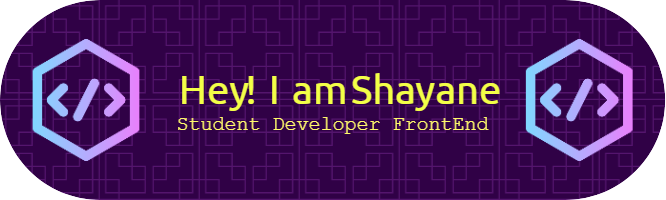

 

<h1 align="left"></h1>
</h1>
<a href="https://shateixeira.github.io/">Visite o meu portfolio</a>

 
 

 

|   Languages   |
|-----------|
|[English](README.md)| 
|[Portuguese](readme_ptBR.md)| 

 

📬 Contact

 
  :computer: In development, starting in the programming area. I'm 20 years old. Technician in Informatica for Internet Integrated to High School by the Federal Institute of Espírito Santo - IFES CAMPUS SERRA. Attending a bachelor's degree in Information Systems from FAESA College. My wish is to work with the frontend. Now I'm focused on ReactJS, and starting the UI/UX Designer course.

   
<!-- About -->

## About Me
  👩‍🎓 Working on the project [Feedback Widget]().
   
  🎓 More advanced skills on *HTML, CSS, JS, Banco de dados, SQL e PHP(básico)*.
   
  🔆 Follow me on [Instagram](https://www.instagram.com/byte__dev/)
   
  💻 Visit my projects [here](https://github.com/ShaTeixeira?tab=repositories)
   
  🔷 Initiating studies *ReactJS*.
   
  💥 Like to play guitar and ukulele, read and watch series.
  
 

## 🛠 Tools
&nbsp;
&nbsp;
&nbsp;

 

## 🛠 Dependency Manager
&nbsp;
&nbsp;

 

## 🛠 Studying
&nbsp;
<!--&nbsp;-->
&nbsp;

 

## 🛠 Tech Stack

&nbsp;
&nbsp;
&nbsp;
&nbsp;
&nbsp;
&nbsp;

 

## My GitHub Stats 📈

&nbsp;
